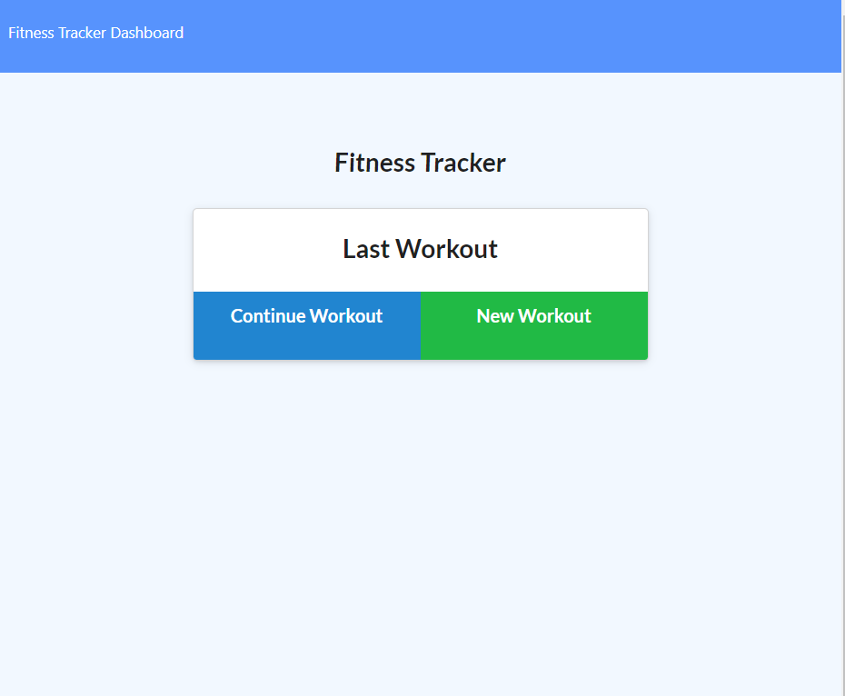

# JY Workout Tracker

## Description
This Project uses Express, MongoDB with Mongoose, hosted with Heroku, with some front-end code; to provide a simple workout tracker.  User may enter workouts and view some basic stats on their workouts for the week.
## Table of Contents
* [`Project`](#)
* [`Description`](#Description)
* [`Table of Contents`](#Table-of-Contents)
* [`1nstallation Steps`](#Installation-Steps)
* [`Usage Information`](#Usage-Information)
* [`Testing`](#Testing)
* [`License`](#License)
* [`Contributing`](#Contributing)
* [`Questions`](#Questions)
* [`Sample`](#Sample)
## Installation Steps
To install this project, do the following:
> 1. To Install on "localhost", clone repository to local workspace.
> 2. Open terminal and run "mongod" to ensure the MongoDB service is running.
> 3. In a seperate terminal, in project base directory, run "npm install" to install dependencies.
> 4. Run "npm run seed" to seed the DB with initial information.
> 5. Run "npm run start" to start the application.

## Usage Information
To use this project, do the following:
> 1. Ensure Installation Steps have been complete.
> 2. For localhost, open browser and browse to URL http://localhost:3000
> 3. You may create workouts, add exercises to workout, continue with last workout, complete a workout, view workout stats for the last week

## Testing
To test this project, do the following:
> 1. To test on Heroku, Ensure Installation steps are complete
> 2. Verify Working on localhost, by performing Usage Steps
> 3. Push your local project to heroku, in terminal run commmand "heroku login"
> 4. Login to your Heroku account in the browser window that pops up, then return to terminal.
> 5. Run command "heroku create my_workout_tracker", to create a heroku app from project
> 6. Verify connection between github and heroku by running command "git remote -v"
> 7. Push code to heroku by running "git push heroku master"
> 8. Login to your Heroku account in web browser and find the app just published.
> 9. Ensure you are signed up to use AtlasDB (Heroku compatible NoSQL DB)
> 10. Select "settings" under your app in heroku browser and scroll down to "Domain" area.
> 11. This is where it lists the domain to your hosted app, click the link to open your app website.
> 12. Test app until satisfied.

## License
This project is provided under the None license. For more information on license details click here 
## Contributing
If you wish to contribute, do the following:
> Email me directly or submit pull request to contribute.
## Questions
If you have any question about this repo, you may open an issue or contact me directly at jyoung7223@yahoo.com
You can find more of my work at [My Github Repo](https://github.com/JYoung7223 "My GitHub Repo")
## Sample
Deployed project can be found at: https://still-earth-19142.herokuapp.com/

Below is a sample screenshot:

